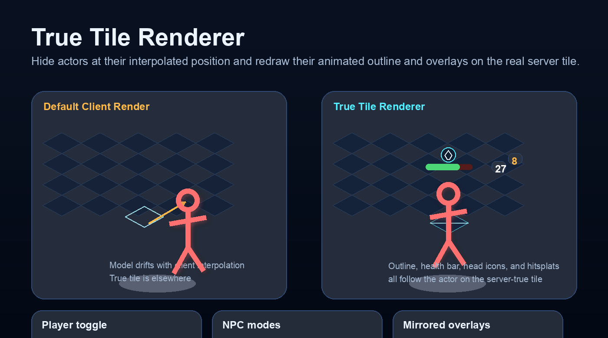
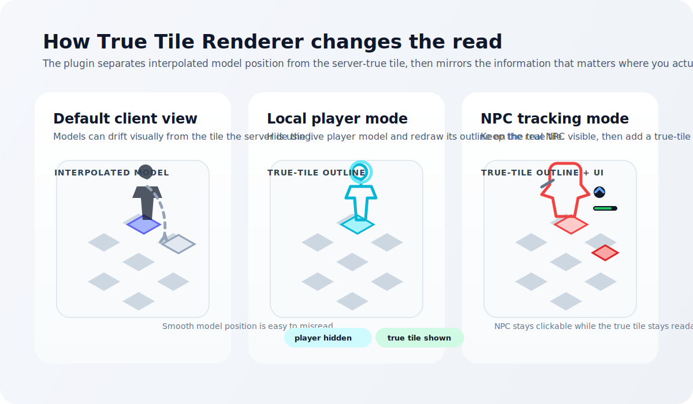

# True Tile Renderer

True Tile Renderer is a RuneLite plugin for visualizing server-true position in a way that is easy to read during real gameplay. It redraws your local player outline on the true tile and adds matching true-tile overlays for selected NPCs.

## Overview

Old School RuneScape renders actors at a smoothed client position that can drift visually from where the server actually considers them to be standing. True Tile Renderer keeps that distinction visible by anchoring outlines and optional combat overlays to the true tile instead of the interpolated model position.

The plugin is designed to help with:

- movement-heavy PvM
- boss spacing and pathing reads
- learning true tile behavior
- spotting model drift during attacks, movement, and target swaps

## Features

- Hides the local player model and redraws its live animated outline on the true tile
- Draws true-tile outlines for selected NPCs while keeping their normal model and clickbox visible
- Supports either the current combat target or a configurable NPC name list
- Mirrors names, health bars, overheads, and hitsplats at the true-tile position
- Uses the actor's live model state, so the true-tile outline follows the current animation frame and orientation
- Supports configurable outline colors, width, and feathering

## Configuration

- Hide the local player model and show a true-tile outline
- Show true-tile outlines for matching NPCs
- Choose between current-target mode and configured-list mode
- Configure a comma- or newline-separated NPC list
- Toggle mirrored names, health bars, overheads, and hitsplats
- Hide the original overhead UI when mirrored overlays are enabled
- Adjust outline colors, width, and feathering
